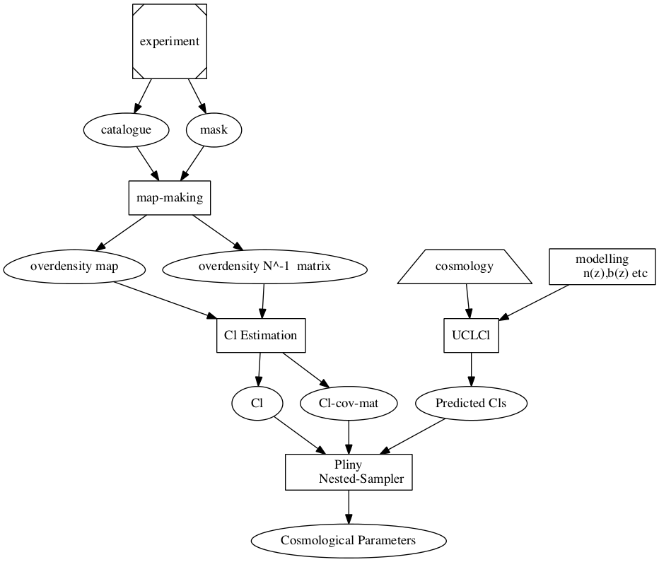

# Documentation for  cosmic-corss-correlation project

Please check the help files for writing documentation at [Markdown](Markdown.md) and [reStructuredText](reStructuredText.rst). If you would like to use more involved python-based Ipython Notebook, please see [Ipython](IpythonNotebook.ipynb). See the rendering using [NbViewer](http://nbviewer.ipython.org/) [here](http://nbviewer.ipython.org/github/tbs1980/CosmicCrossCorrelation/blob/sree_testing_layout/doc/IpythonNotebook.ipynb).

The scinence documentation is below.

## Outline of the project 

An outline of the project as flow-chart is shown below.

## Project calendar

<iframe src="https://www.google.com/calendar/embed?src=n8aotpitt05ds5i9j9gidodc8c%40group.calendar.google.com&ctz=Europe/London" style="border: 0" width="800" height="600" frameborder="0" scrolling="no"></iframe>

